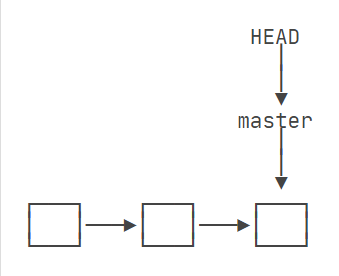
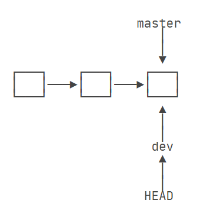
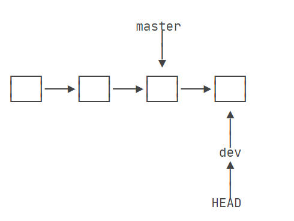
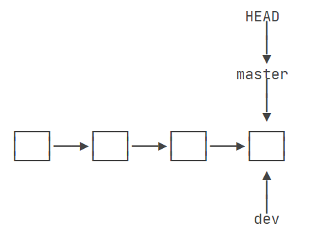
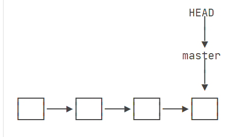
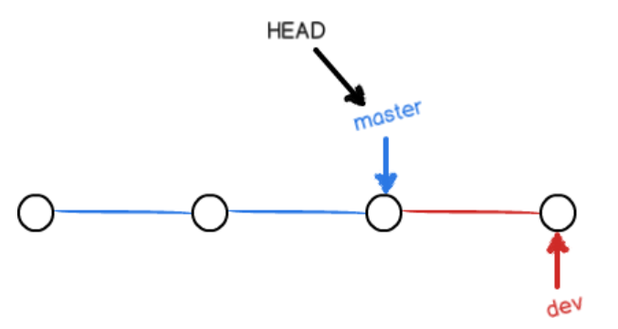
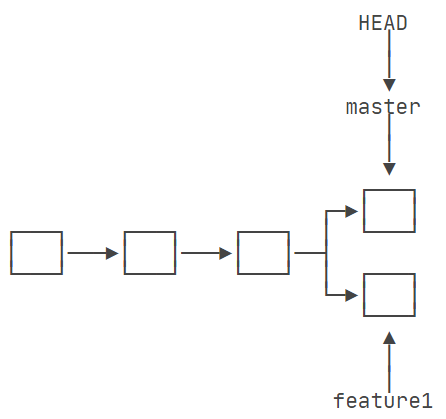
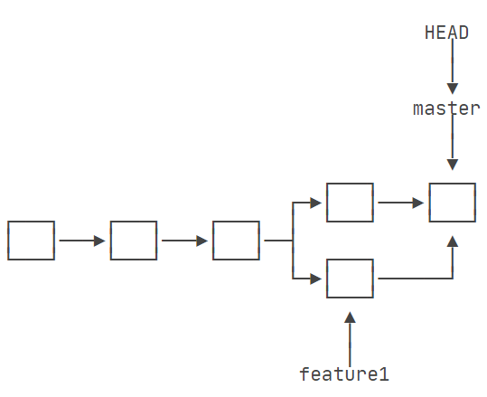
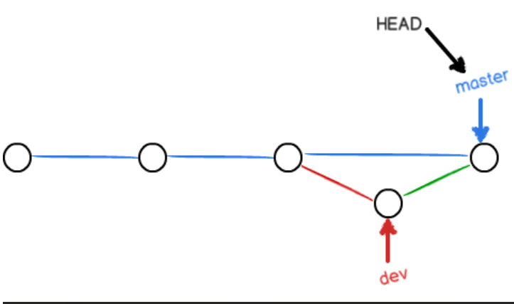
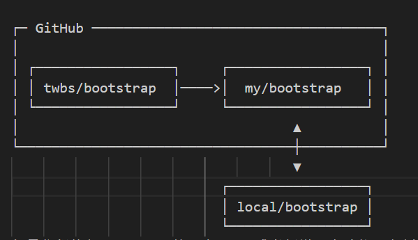

[TOC]


# 安装

在Ubuntu上安装，从源安装(编译安装)

1.如果确实要从源代码安装 Git，则需要具有 Git 依赖的以下库：autotools、curl、zlib、openssl、expat 和 libiconv。例如，如果您使用的系统有dnf（例如 Fedora）或apt-get（例如基于 Debian 的系统），您可以使用这些命令之一来安装用于编译和安装 Git 二进制文件的最小依赖项：

```bash
sudo apt install dh-autoreconf libcurl4-gnutls-dev libexpat1-dev gettext libz-dev libssl-dev
```

2.为了能够添加各种格式（doc、html、info）的文档，需要这些额外的依赖项：

```bash
sudo apt install asciidoc xmlto docbook2x
```

3.您还需要以下软件包install-info：

```bash
sudo apt install install-info
```

当您拥有所有必要的依赖项时，您可以继续从几个地方获取最新标记的发布 tarball。您可以通过 kernel.org 站点 https://www.kernel.org/pub/software/scm/git 或 GitHub 网站上的镜像 https://github.com/git/git/tags 。GitHub 页面上的最新版本通常更清楚一点，但如果您想验证下载，kernel.org 页面也有发布签名。

4.然后，编译安装：

```bash
tar -zxf git-2.8.0.tar.gz
cd git-2.8.0
make configure
./configure --prefix=/usr/local/git
make all doc info
sudo make install install-doc install-html install-info
```
5.这样做之后，你还可以通过 Git 本身获取 Git 进行更新：

    git clone https://git.kernel.org/pub/scm/git/git.git

# 创建版本库
什么是版本库呢？版本库又名仓库，英文名repository，你可以简单理解成一个目录，这个目录里面的所有文件都可以被Git管理起来，每个文件的修改、删除，Git都能跟踪，以便任何时刻都可以追踪历史，或者在将来某个时刻可以“还原”。

所以，创建一个版本库非常简单，首先，选择一个合适的地方，创建一个空目录：
```
$ mkdir learngit
$ cd learngit
$ pwd
/Users/michael/learngit
```
**pwd** 命令用于显示当前目录。

## git init
第二步，通过git init命令把这个目录变成Git可以管理的仓库：
```
$ git init
Initialized empty Git repository in /Users/michael/learngit/.git/
```
瞬间Git就把仓库建好了，而且告诉你是一个空的仓库（empty Git repository），细心的读者可以发现当前目录下多了一个.git的目录，这个目录是Git来跟踪管理版本库的，没事千万不要手动修改这个目录里面的文件，不然改乱了，就把Git仓库给破坏了。

如果你没有看到 **.git** 目录，那是因为这个目录默认是隐藏的，用ls -ah命令就可以看见。

也不一定必须在空目录下创建Git仓库，选择一个已经有东西的目录也是可以的。不过，不建议你使用自己正在开发的公司项目来学习Git，否则造成的一切后果概不负责。

* 把文件添加到版本库
现在我们编写一个readme.txt文件，内容如下：
```
Git is a version control system.
Git is free software.
```
一定要放到**learngit**目录下（子目录也行），因为这是一个Git仓库，放到其他地方Git再厉害也找不到这个文件。

把一个文件放到Git仓库只需要两步。
## git add

第一步，用命令**git add**告诉Git，把文件添加到仓库：
```
$ git add readme.txt
```
执行上面的命令，没有任何显示，这就对了

## git commit

第二步，用命令 **git commit** 告诉Git，把文件提交到仓库：
```
$ git commit -m "wrote a readme file"
[master (root-commit) eaadf4e] wrote a readme file
 1 file changed, 2 insertions(+)
 create mode 100644 readme.txt
```
简单解释一下 **git commit** 命令，**-m** 后面输入的是本次提交的说明，可以输入任意内容，当然最好是有意义的，这样你就能从历史记录里方便地找到改动记录。

**git commit** 命令执行成功后会告诉你，**1 file changed：** 1个文件被改动（我们新添加的readme.txt文件）；**2 insertions：** 插入了两行内容（readme.txt有两行内容）。

为什么Git添加文件需要add，commit一共两步呢？因为commit可以一次提交很多文件，所以你可以多次add不同的文件，比如：
```
$ git add file1.txt
$ git add file2.txt file3.txt
$ git commit -m "add 3 files."
```

## git status
我们已经成功地添加并提交了一个readme.txt文件，现在，是时候继续工作了，于是，我们继续修改readme.txt文件，改成如下内容：
```
Git is a distributed version control system.
Git is free software.
```
现在，运行 **git status** 命令看看结果：
```
$ git status
On branch master
Changes not staged for commit:
  (use "git add <file>..." to update what will be committed)
  (use "git checkout -- <file>..." to discard changes in working directory)

	modified:   readme.txt

no changes added to commit (use "git add" and/or "git commit -a")
```
**git status** 命令可以让我们时刻掌握仓库当前的状态，上面的命令输出告诉我们，readme.txt被修改过了，但还没有准备提交的修改。

**git diff** 
虽然Git告诉我们readme.txt被修改了，但如果能看看具体修改了什么内容，自然是很好的。比如你休假两周从国外回来，第一天上班时，已经记不清上次怎么修改的readme.txt，所以，需要用**git diff**这个命令看看：
```
$ git diff readme.txt 
diff --git a/readme.txt b/readme.txt
index 46d49bf..9247db6 100644
--- a/readme.txt
+++ b/readme.txt
@@ -1,2 +1,2 @@
-Git is a version control system.
+Git is a distributed version control system.
 Git is free software.
```
**git diff**顾名思义就是查看difference，显示的格式正是Unix通用的diff格式，可以从上面的命令输出看到，我们在第一行添加了一个**distributed**单词。

知道了对readme.txt作了什么修改后，再把它提交到仓库就放心多了，提交修改和提交新文件是一样的两步，第一步是**git add**：
```
$ git add readme.txt
```
同样没有任何输出。在执行第二步**git commit**之前，我们再运行**git status**看看当前仓库的状态：
```
$ git status
On branch master
Changes to be committed:
  (use "git reset HEAD <file>..." to unstage)

	modified:   readme.txt
```
``git status``告诉我们，将要被提交的修改包括``readme.txt``，下一步，就可以放心地提交了：
```
$ git commit -m "add distributed"
[master e475afc] add distributed
 1 file changed, 1 insertion(+), 1 deletion(-)
```
提交后，我们再用``git status``命令看看仓库的当前状态：
```
$ git status
On branch master
nothing to commit, working tree clean
```
Git告诉我们当前没有需要提交的修改，而且，工作目录是干净（working tree clean）的。
# 版本回退
## git log
现在，你已经学会了修改文件，然后把修改提交到Git版本库，现在，再练习一次，修改readme.txt文件如下：
```
Git is a distributed version control system.
Git is free software distributed under the GPL.
```
然后尝试提交：
```
$ git add readme.txt
$ git commit -m "append GPL"
[master 1094adb] append GPL
 1 file changed, 1 insertion(+), 1 deletion(-)
```
 像这样，你不断对文件进行修改，然后不断提交修改到版本库里，就好比玩RPG游戏时，每通过一关就会自动把游戏状态存盘，如果某一关没过去，你还可以选择读取前一关的状态。有些时候，在打Boss之前，你会手动存盘，以便万一打Boss失败了，可以从最近的地方重新开始。Git也是一样，每当你觉得文件修改到一定程度的时候，就可以“保存一个快照”，这个快照在Git中被称为``commit``。一旦你把文件改乱了，或者误删了文件，还可以从最近的一个``commit``恢复，然后继续工作，而不是把几个月的工作成果全部丢失。

 现在，我们回顾一下readme.txt文件一共有几个版本被提交到Git仓库里了：

版本1：``wrote a readme file``
```
Git is a version control system.
Git is free software.
```
版本2：``add distributed``

```
Git is a distributed version control system.
Git is free software. 
```
版本3：``append GPL``
```
Git is a distributed version control system.
Git is free software distributed under the GPL.
```
当然了，在实际工作中，我们脑子里怎么可能记得一个几千行的文件每次都改了什么内容，不然要版本控制系统干什么。版本控制系统肯定有某个命令可以告诉我们历史记录，在Git中，我们用``git log``命令查看：
```
$ git log
commit 1094adb7b9b3807259d8cb349e7df1d4d6477073 (HEAD -> master)
Author: Michael Liao <askxuefeng@gmail.com>
Date:   Fri May 18 21:06:15 2018 +0800

    append GPL

commit e475afc93c209a690c39c13a46716e8fa000c366
Author: Michael Liao <askxuefeng@gmail.com>
Date:   Fri May 18 21:03:36 2018 +0800

    add distributed

commit eaadf4e385e865d25c48e7ca9c8395c3f7dfaef0
Author: Michael Liao <askxuefeng@gmail.com>
Date:   Fri May 18 20:59:18 2018 +0800

    wrote a readme file
```
``git log``命令显示从最近到最远的提交日志，我们可以看到3次提交，最近的一次是``append GPL``，上一次是``add distributed``，最早的一次是``wrote a readme file``。

如果嫌输出信息太多，看得眼花缭乱的，可以试试加上``--pretty=oneline``参数：
```
$ git log --pretty=oneline
1094adb7b9b3807259d8cb349e7df1d4d6477073 (HEAD -> master) append GPL
e475afc93c209a690c39c13a46716e8fa000c366 add distributed
eaadf4e385e865d25c48e7ca9c8395c3f7dfaef0 wrote a readme file
```
需要友情提示的是，你看到的一大串类似``1094adb...``的是``commit id``（版本号），和SVN不一样，Git的``commit id``不是1，2，3……递增的数字，而是一个SHA1计算出来的一个非常大的数字，用十六进制表示，而且你看到的``commit id``和我的肯定不一样，以你自己的为准。为什么``commit id``需要用这么一大串数字表示呢？因为Git是分布式的版本控制系统，后面我们还要研究多人在同一个版本库里工作，如果大家都用1，2，3……作为版本号，那肯定就冲突了。

每提交一个新版本，实际上Git就会把它们自动串成一条时间线。

## git reset
现在准备把``readme.txt``回退到上一个版本，也就是``add distributed``的那个版本，怎么做呢？

首先，``Git``必须知道当前版本是哪个版本，在``Git``中，用``HEAD``表示当前版本，也就是最新的提交``1094adb...``（注意我的提交ID和你的肯定不一样），上一个版本就是``HEAD^``，上上一个版本就是``HEAD^^``，当然往上100个版本写100个^比较容易数不过来，所以写成``HEAD~100``。

现在，我们要把当前版本``append GPL``回退到上一个版本``add distributed``，就可以使用``git reset``命令：
```
$ git reset --hard HEAD^
HEAD is now at e475afc add distributed
```
``--hard``参数有啥意义？这个后面再讲，现在你先放心使用。

如果向返回回退前的版本怎么办，你会发现``git``仓库里已经没有那个最新的版本了，于是你可以顺着之前的命令窗口往上找啊找啊，找到那个``append GPL``的``commit id``是``1094adb...``，于是就可以指定回到未来的某个版本：
```
$ git reset --hard 1094a
HEAD is now at 83b0afe append GPL
```
版本号没必要写全，前几位就可以了，``Git``会自动去找。当然也不能只写前一两位，因为``Git``可能会找到多个版本号，就无法确定是哪一个了。

但是如果命令窗口关闭了怎么办？
想恢复到新版本怎么办？找不到新版本的commit id怎么办？

## git reflog
``Git``提供了一个命令``git reflog``用来记录你的每一次命令：
```
$ git reflog
e475afc HEAD@{1}: reset: moving to HEAD^
1094adb (HEAD -> master) HEAD@{2}: commit: append GPL
e475afc HEAD@{3}: commit: add distributed
eaadf4e HEAD@{4}: commit (initial): wrote a readme file
```

从输出可知，``append GPL``的``commit id``是1094adb
# 工作区和暂存区
工作区（Working Directory）
就是你在电脑里能看到的目录，比如我的``learngit``文件夹就是一个工作区.
版本库（Repository）
工作区有一个隐藏目录``.git``，这个不算工作区，而是``Git``的版本库。

Git的版本库里存了很多东西，其中最重要的就是称为``stage``（或者叫``index``）的暂存区，还有Git为我们自动创建的第一个分支``master``，以及指向``master``的一个指针叫``HEAD``。


分支和HEAD的概念我们以后再讲。

前面讲了我们把文件往Git版本库里添加的时候，是分两步执行的：

第一步是用``git add``把文件添加进去，实际上就是把文件修改添加到暂存区；

第二步是用``git commit``提交更改，实际上就是把暂存区的所有内容提交到当前分支。

因为我们创建Git版本库时，Git自动为我们创建了唯一一个``master``分支，所以，现在，``git commit``就是往``master``分支上提交更改。

你可以简单理解为，需要提交的文件修改后放到暂存区，然后，一次性提交暂存区的所有修改。
## git checkout -- file
当你``git add``一个文件之后，你想丢弃工作区添加的修改，可以用``git checkout --file``这个命令丢弃工作区的修改。
 ``$ git checkout -- readme.txt``
 命令``git checkout -- readme.txt``意思就是，把``readme.txt``文件在工作区的修改全部撤销，这里有两种情况：

一种是`readme.txt`自修改后还没有被放到暂存区，现在，撤销修改就回到和版本库一模一样的状态；

一种是`readme.txt`已经添加到暂存区后，又作了修改，现在，撤销修改就回到添加到暂存区后的状态。

总之，就是让这个文件回到最近一次`git commit或git add`时的状态。

`git checkout -- file`命令中的--很重要，没有`--`，就变成了“切换到另一个分支”的命令，我们在后面的分支管理中会再次遇到`git checkout`命令。

## git rm
在Git中，删除也是一个修改操作，我们实战一下，先添加一个新文件`test.txt`到Git并且提交：
```
$ git add test.txt

$ git commit -m "add test.txt"
[master b84166e] add test.txt
 1 file changed, 1 insertion(+)
 create mode 100644 test.txt
```
一般情况下，你通常直接在文件管理器中把没用的文件删了，或者用`rm`命令删了：
```
$ rm test.txt
```
这个时候，Git知道你删除了文件，因此，工作区和版本库就不一致了，`git status`命令会立刻告诉你哪些文件被删除了：
```
$ git status
On branch master
Changes not staged for commit:
  (use "git add/rm <file>..." to update what will be committed)
  (use "git checkout -- <file>..." to discard changes in working directory)

	deleted:    test.txt

no changes added to commit (use "git add" and/or "git commit -a")
```
现在你有两个选择，一是确实要从版本库中删除该文件，那就用命令`git rm`删掉，并且`git commit`：
```
$ git rm test.txt
rm 'test.txt'

$ git commit -m "remove test.txt"
[master d46f35e] remove test.txt
 1 file changed, 1 deletion(-)
 delete mode 100644 test.txt
```
现在，文件就从版本库中被删除了。

 小提示：先手动删除文件，然后使用``git rm <file>``和``git add<file>``效果是一样的。

另一种情况是删错了，因为版本库里还有呢，所以可以很轻松地把误删的文件恢复到最新版本：
```
$ git checkout -- test.txt
```
`git checkout`其实是用版本库里的版本替换工作区的版本，无论工作区是修改还是删除，都可以“一键还原”。

# Git远程仓库
其实一台电脑上也是可以克隆多个版本库的，只要不在同一个目录下。不过，现实生活中是不会有人这么傻的在一台电脑上搞几个远程库玩，因为一台电脑上搞几个远程库完全没有意义，而且硬盘挂了会导致所有库都挂掉，所以我也不告诉你在一台电脑上怎么克隆多个仓库。

实际情况往往是这样，找一台电脑充当服务器的角色，每天24小时开机，其他每个人都从这个“服务器”仓库克隆一份到自己的电脑上，并且各自把各自的提交推送到服务器仓库里，也从服务器仓库中拉取别人的提交。

[Github](https://github.com)这个网站就是提供Git仓库托管服务的，所以，只要注册一个GitHub账号，就可以免费获得Git远程仓库。

在继续阅读后续内容前，请自行注册GitHub账号。由于你的本地Git仓库和GitHub仓库之间的传输是通过SSH加密的，所以，需要一点设置：

第1步：创建``SSH Key``。在用户主目录下，看看有没有``.ssh``目录，如果有，再看看这个目录下有没有``id_rsa``和``id_rsa.pub``这两个文件，如果已经有了，可直接跳到下一步。如果没有，打开Shell（Windows下打开Git Bash），创建``SSH Key``：
```
$ ssh-keygen -t rsa -C "youremail@example.com"
```
你需要把邮件地址换成你自己的邮件地址，然后一路回车，使用默认值即可，由于这个Key也不是用于军事目的，所以也无需设置密码。

如果一切顺利的话，可以在用户主目录里找到``.ssh``目录，里面有``id_rsa``和``id_rsa.pub``两个文件，这两个就是``SSH Key``的秘钥对，``id_rsa``是私钥，不能泄露出去，``id_rsa.pub``是公钥，可以放心地告诉任何人。

第2步：登陆GitHub，打开``“Account settings”``，``“SSH Keys”``页面：

然后，点``“Add SSH Key”``，填上任意Title，在Key文本框里粘贴``id_rsa.pub``文件的内容。
点``“Add Key”``，你就应该看到已经添加的Key

当然，GitHub允许你添加多个Key。假定你有若干电脑，你一会儿在公司提交，一会儿在家里提交，只要把每台电脑的Key都添加到GitHub，就可以在每台电脑上往GitHub推送了。

最后友情提示，在GitHub上免费托管的Git仓库，任何人都可以看到喔（但只有你自己才能改）。所以，不要把敏感信息放进去

## 添加远程库
现在的情景是，你已经在本地创建了一个Git仓库后，又想在GitHub创建一个Git仓库，并且让这两个仓库进行远程同步，这样，GitHub上的仓库既可以作为备份，又可以让其他人通过该仓库来协作，真是一举多得。

首先，登陆GitHub，然后，在右上角找到“Create a new repo”按钮，创建一个新的仓库：

在Repository name填入``learngit``，其他保持默认设置，点击“Create repository”按钮，就成功地创建了一个新的Git仓库.

目前，在GitHub上的这个``learngit``仓库还是空的，GitHub告诉我们，可以从这个仓库克隆出新的仓库，也可以把一个已有的本地仓库与之关联，然后，把本地仓库的内容推送到GitHub仓库。

现在，我们根据GitHub的提示，在本地的``learngit``仓库下运行命令:
```
$ git remote add origin git@github.com:michaelliao/learngit.git
```
请千万注意，把上面的``michaelliao``替换成你自己的GitHub账户名，否则，你在本地关联的就是我的远程库，关联没有问题，但是你以后推送是推不上去的，因为你的SSH Key公钥不在我的账户列表中。

添加后，远程库的名字就是``origin``，这是Git默认的叫法，也可以改成别的.

### git push

下一步，就可以把本地库的所有内容推送到远程库上:
```
$ git push -u origin master
Counting objects: 20, done.
Delta compression using up to 4 threads.
Compressing objects: 100% (15/15), done.
Writing objects: 100% (20/20), 1.64 KiB | 560.00 KiB/s, done.
Total 20 (delta 5), reused 0 (delta 0)
remote: Resolving deltas: 100% (5/5), done.
To github.com:michaelliao/learngit.git
 * [new branch]      master -> master
Branch 'master' set up to track remote branch 'master' from 'origin'.
```
由于远程库是空的，我们第一次推送``master``分支时，加上了`-u`参数，Git不但会把本地的`master`分支内容推送的远程新的`master`分支，还会把本地的master分支和远程的`master`分支关联起来，在以后的推送或者拉取时就可以简化命令。

推送成功后，可以立刻在GitHub页面中看到远程库的内容已经和本地一模一样.

从现在起，只要本地作了提交，就可以通过命令：
```
$ git push origin master
```
把本地`master`分支的最新修改推送至GitHub，现在，你就拥有了真正的分布式版本库！

### SSH警告
当你第一次使用Git的`clone`或者`push`命令连接GitHub时，会得到一个警告：
```
The authenticity of host 'github.com (xx.xx.xx.xx)' can't be established.
RSA key fingerprint is xx.xx.xx.xx.xx.
Are you sure you want to continue connecting (yes/no)?
```
这是因为Git使用SSH连接，而SSH连接在第一次验证GitHub服务器的Key时，需要你确认GitHub的Key的指纹信息是否真的来自GitHub的服务器，输入yes回车即可。

Git会输出一个警告，告诉你已经把GitHub的Key添加到本机的一个信任列表里了：
```
Warning: Permanently added 'github.com' (RSA) to the list of known hosts.
```
这个警告只会出现一次，后面的操作就不会有任何警告了。

如果你实在担心有人冒充GitHub服务器，输入yes前可以对照GitHub的RSA Key的指纹信息是否与SSH连接给出的一致。

## 删除远程库

想删除远程库，可以用`git remote rm <name>`命令。使用前，建议先用`git remote -v`查看远程库信息：
```
$ git remote -v
origin  git@github.com:michaelliao/learn-git.git (fetch)
origin  git@github.com:michaelliao/learn-git.git (push)
```
然后，根据名字删除，比如删除origin：
```
$ git remote rm origin
```
此处的“删除”其实是解除了本地和远程的绑定关系，并不是物理上删除了远程库。远程库本身并没有任何改动。要真正删除远程库，需要登录到GitHub，在后台页面找到删除按钮再删除。

## 从远程库克隆
我们从零开发，先创建远程库，然后，从远程库克隆。
首先，登陆GitHub，创建一个新的仓库，名字叫`gitskills`
我们勾选`Initialize this repository with a README`，这样GitHub会自动为我们创建一个`README.md`文件。创建完毕后，可以看到`README.md`文件。

现在，远程库已经准备好了，下一步是用命令`git clone`克隆一个本地库:

```
$ git clone git@github.com:michaelliao/gitskills.git
Cloning into 'gitskills'...
remote: Counting objects: 3, done.
remote: Total 3 (delta 0), reused 0 (delta 0), pack-reused 3
Receiving objects: 100% (3/3), done.
```

注意把Git库的地址换成你自己的，然后进入`gitskills`目录看看，已经有`README.md`文件了。`git clone` 后的目录就在当前文件夹。
```
$ cd gitskills
$ ls
README.md
```

你也许还注意到，GitHub给出的地址不止一个，还可以用``https://github.com/michaelliao/gitskills.git``这样的地址。实际上，Git支持多种协议，默认的``git://``使用``ssh``，但也可以使用``https``等其他协议。

使用`https`除了速度慢以外，还有个最大的麻烦是每次推送都必须输入口令，但是在某些只开放`https`端口的公司内部就无法使用ssh协议而只能用`https`。

# 分支管理

在版本回退里，你已经知道，每次提交，Git都把它们串成一条时间线，这条时间线就是一个分支。截止到目前，只有一条时间线，在Git里，这个分支叫主分支，即`master`分支。`HEAD`严格来说不是指向提交，而是指向`master`，`master`才是指向提交的，所以，`HEAD`指向的就是当前分支。

一开始的时候，`master`分支是一条线，Git用`master`指向最新的提交，再用`HEAD`指向m`aster`，就能确定当前分支，以及当前分支的提交点：


每次提交，`master`分支都会向前移动一步，这样，随着你不断提交，`master`分支的线也越来越长。

当我们创建新的分支，例如`dev`时，Git新建了一个指针叫`dev`，指向`master`相同的提交，再把`HEAD`指向`dev`，就表示当前分支在`dev`上：


你看，Git创建一个分支很快，因为除了增加一个`dev`指针，改改`HEAD`的指向，工作区的文件都没有任何变化！

不过，从现在开始，对工作区的修改和提交就是针对`dev`分支了，比如新提交一次后，`dev`指针往前移动一步，而`master`指针不变：


假如我们在`dev`上的工作完成了，就可以把`dev`合并到`master`上。Git怎么合并呢？最简单的方法，就是直接把`master`指向`dev`的当前提交，就完成了合并：



所以Git合并分支也很快！就改改指针，工作区内容也不变！

合并完分支后，甚至可以删除`dev`分支。删除dev分支就是把dev指针给删掉，删掉后，我们就剩下了一条`master`分支：



## 创建分支与合并分支
### git checkout
首先，我们创建`dev`分支，然后切换到`dev`分支：
```
$ git checkout -b dev
Switched to a new branch 'dev'
```
`git checkout`命令加上`-b`参数表示创建并切换，相当于以下两条命令：
```
$ git branch dev
$ git checkout dev
Switched to branch 'dev'
```
### git branch
然后，用`git branch`命令查看当前分支：
```
$ git branch
* dev
  master
```
`git branch`命令会列出所有分支，当前分支前面会标一个`*`号。

然后，我们就可以在`dev`分支上正常提交，比如对`readme.txt`做个修改，加上一行：
```
Creating a new branch is quick.
```
然后提交：
```
$ git add readme.txt 
$ git commit -m "branch test"
[dev b17d20e] branch test
 1 file changed, 1 insertion(+)
```
现在，dev分支的工作完成，我们就可以切换回`master`分支：
```
$ git checkout master
Switched to branch 'master'
```
切换回`master`分支后，再查看一个`readme.txt`文件，刚才添加的内容不见了！因为那个提交是在`dev`分支上，而`master`分支此刻的提交点并没有变：


### git merge
现在，我们把`dev`分支的工作成果合并到`master`分支上：
```
$ git merge dev
Updating d46f35e..b17d20e
Fast-forward
 readme.txt | 1 +
 1 file changed, 1 insertion(+)
```
`git merge`命令用于合并指定分支到当前分支。合并后，再查看`readme.txt`的内容，就可以看到，和`dev`分支的最新提交是完全一样的。

注意到上面的`Fast-forward`信息，Git告诉我们，这次合并是“快进模式”，也就是直接把`master`指向`dev`的当前提交，所以合并速度非常快。

当然，也不是每次合并都能Fast-forward，我们后面会讲其他方式的合并。

合并完成后，就可以放心地删除dev分支了：
```
$ git branch -d dev
Deleted branch dev (was b17d20e).
```
删除后，查看`branch`，就只剩下`master`分支了：
```
$ git branch
* master
```
因为创建、合并和删除分支非常快，所以Git鼓励你使用分支完成某个任务，合并后再删掉分支，这和直接在`master`分支上工作效果是一样的，但过程更安全。


### git switch
我们注意到切换分支使用`git checkout <branch>`，而前面讲过的撤销修改则是`git checkout -- <file>`，同一个命令，有两种作用，确实有点令人迷惑。

实际上，切换分支这个动作，用`switch`更科学。因此，最新版本的Git提供了新的`git switch`命令来切换分支：

创建并切换到新的`dev`分支，可以使用：
```
$ git switch -c dev
```
直接切换到已有的`master`分支，可以使用：
```
$ git switch master
```
使用新的`git switch`命令，比`git checkout`要更容易理解。

## 解决冲突
准备新的`feature1`分支，继续我们的新分支开发：
```
$ git switch -c feature1
Switched to a new branch 'feature1'
```
修改`readme.txt`最后一行，改为：
```
Creating a new branch is quick AND simple.
```
在`feature1`分支上提交：
```
$ git add readme.txt

$ git commit -m "AND simple"
[feature1 14096d0] AND simple
 1 file changed, 1 insertion(+), 1 deletion(-)
```
切换到`master`分支：
```
$ git switch master
Switched to branch 'master'
Your branch is ahead of 'origin/master' by 1 commit.
  (use "git push" to publish your local commits)
```
Git还会自动提示我们当前`master`分支比远程的`master`分支要超前1个提交。

在`master`分支上把`readme.txt`文件的最后一行改为：
```
Creating a new branch is quick & simple.
```
提交：
```
$ git add readme.txt 
$ git commit -m "& simple"
[master 5dc6824] & simple
 1 file changed, 1 insertion(+), 1 deletion(-)
```
现在，`master`分支和`feature1`分支各自都分别有新的提交，变成了这样：


这种情况下，Git无法执行“快速合并”，只能试图把各自的修改合并起来，但这种合并就可能会有冲突，我们试试看：
```
$ git merge feature1
Auto-merging readme.txt
CONFLICT (content): Merge conflict in readme.txt
Automatic merge failed; fix conflicts and then commit the result.
```
果然冲突了！Git告诉我们，`readme.txt`文件存在冲突，必须手动解决冲突后再提交。`git status`也可以告诉我们冲突的文件：
```
$ git status
On branch master
Your branch is ahead of 'origin/master' by 2 commits.
  (use "git push" to publish your local commits)

You have unmerged paths.
  (fix conflicts and run "git commit")
  (use "git merge --abort" to abort the merge)

Unmerged paths:
  (use "git add <file>..." to mark resolution)

	both modified:   readme.txt

no changes added to commit (use "git add" and/or "git commit -a")
```

我们可以直接查看`readme.txt`的内容：
```
Git is a distributed version control system.
Git is free software distributed under the GPL.
Git has a mutable index called stage.
Git tracks changes of files.
<<<<<<< HEAD
Creating a new branch is quick & simple.
=======
Creating a new branch is quick AND simple.
>>>>>>> feature1
```
Git用`<<<<<<<`，`=======`，`>>>>>>>`标记出不同分支的内容，我们修改如下后保存：

`Creating a new branch is quick and simple.`
再提交：

```
$ git add readme.txt 
$ git commit -m "conflict fixed"
[master cf810e4] conflict fixed
```
现在，`master`分支和`feature1`分支变成了下图所示：


用带参数的`git log`也可以看到分支的合并情况：
```
$ git log --graph --pretty=oneline --abbrev-commit
*   cf810e4 (HEAD -> master) conflict fixed
|\  
| * 14096d0 (feature1) AND simple
* | 5dc6824 & simple
|/  
* b17d20e branch test
* d46f35e (origin/master) remove test.txt
* b84166e add test.txt
* 519219b git tracks changes
* e43a48b understand how stage works
* 1094adb append GPL
* e475afc add distributed
* eaadf4e wrote a readme file
```
最后，删除`feature1`分支：
```
$ git branch -d feature1
Deleted branch feature1 (was 14096d0).
```
工作完成。

## 分支管理策略（git merge --no-ff）
通常，合并分支时，如果可能，Git会用`Fast forward`模式，但这种模式下，删除分支后，会丢掉分支信息。

如果要强制禁用`Fast forward`模式，Git就会在merge时生成一个新的commit，这样，从分支历史上就可以看出分支信息。

下面我们实战一下`--no-ff`方式的`git merge`：
首先，仍然创建并切换`dev`分支：
```
$ git switch -c dev
Switched to a new branch 'dev'
```
修改`readme.txt`文件，并提交一个新的`commit`：
```
$ git add readme.txt 
$ git commit -m "add merge"
[dev f52c633] add merge
 1 file changed, 1 insertion(+)
```
现在，我们切换回`master`：
```
$ git switch master
Switched to branch 'master'
```
准备合并`dev`分支，请注意`--no-ff`参数，表示禁用`Fast forward`：
```
$ git merge --no-ff -m "merge with no-ff" dev
Merge made by the 'recursive' strategy.
 readme.txt | 1 +
 1 file changed, 1 insertion(+)
```
因为本次合并要创建一个新的`commit`，所以加上`-m`参数，把`commit`描述写进去。

合并后，我们用`git log`看看分支历史：
```
$ git log --graph --pretty=oneline --abbrev-commit
*   e1e9c68 (HEAD -> master) merge with no-ff
|\  
| * f52c633 (dev) add merge
|/  
*   cf810e4 conflict fixed
...
```
可以看到，不使用`Fast forward`模式，`merge`后就像这样：


## bug分支
当你接到一个修复一个代号101的bug的任务时，很自然地，你想创建一个分支`issue-101`来修复它，但是，等等，当前正在dev上进行的工作还没有提交：
```
$ git status
On branch dev
Changes to be committed:
  (use "git reset HEAD <file>..." to unstage)

	new file:   hello.py

Changes not staged for commit:
  (use "git add <file>..." to update what will be committed)
  (use "git checkout -- <file>..." to discard changes in working directory)

	modified:   readme.txt
```
并不是你不想提交，而是工作只进行到一半，还没法提交，预计完成还需1天时间。但是，必须在两个小时内修复该bug，怎么办？

### git stash
幸好，Git还提供了一个`stash`功能，可以把当前工作现场“储藏”起来，等以后恢复现场后继续工作：
```
$ git stash
Saved working directory and index state WIP on dev: f52c633 add merge
```
现在，用`git status`查看工作区，就是干净的（除非有没有被Git管理的文件），因此可以放心地创建分支来修复bug。

首先确定要在哪个分支上修复bug，假定需要在`master`分支上修复，就从`master`创建临时分支：
```
$ git checkout master
Switched to branch 'master'
Your branch is ahead of 'origin/master' by 6 commits.
  (use "git push" to publish your local commits)

$ git checkout -b issue-101
Switched to a new branch 'issue-101'
```
现在修复bug，需要把`“Git is free software ...”`改为`“Git is a free software ...”`，然后提交：
```
$ git add readme.txt 
$ git commit -m "fix bug 101"
[issue-101 4c805e2] fix bug 101
 1 file changed, 1 insertion(+), 1 deletion(-)
```
修复完成后，切换到`master`分支，并完成合并，最后删除`issue-101`分支：
```
$ git switch master
Switched to branch 'master'
Your branch is ahead of 'origin/master' by 6 commits.
  (use "git push" to publish your local commits)

$ git merge --no-ff -m "merged bug fix 101" issue-101
Merge made by the 'recursive' strategy.
 readme.txt | 2 +-
 1 file changed, 1 insertion(+), 1 deletion(-)
```
接着回到dev分支
```
$ git switch dev
Switched to branch 'dev'

$ git status
On branch dev
nothing to commit, working tree clean
```
工作区是干净的，刚才的工作现场存到哪去了？用`git stash list`命令看看：
```
$ git stash list
stash@{0}: WIP on dev: f52c633 add merge
```
工作现场还在，Git把`stash`内容存在某个地方了，但是需要恢复一下，有两个办法：

一是用`git stash apply`恢复，但是恢复后，`stash`内容并不删除，你需要用`git stash drop`来删除；

另一种方式是用`git stash pop`，恢复的同时把`stash`内容也删了：
```
$ git stash pop
On branch dev
Changes to be committed:
  (use "git reset HEAD <file>..." to unstage)

	new file:   hello.py

Changes not staged for commit:
  (use "git add <file>..." to update what will be committed)
  (use "git checkout -- <file>..." to discard changes in working directory)

	modified:   readme.txt

Dropped refs/stash@{0} (5d677e2ee266f39ea296182fb2354265b91b3b2a)
```
再用`git stash list`查看，就看不到任何`stash`内容了：
```
$ git stash list
```
你可以多次`stash`，恢复的时候，先用`git stash list`查看，然后恢复指定的`stash`，用命令：
```
$ git stash apply stash@{0}
```

在`master`分支上修复了bug后，我们要想一想，`dev`分支是早期从`master`分支分出来的，所以，这个bug其实在当前`dev`分支上也存在。

那怎么在`dev`分支上修复同样的bug？重复操作一次，提交不就行了？

**有木有更简单的方法？**

有！

同样的bug，要在`dev`上修复，我们只需要把`4c805e2 fix bug 101`这个提交所做的修改“复制”到`dev`分支。注意：我们只想复制`4c805e2 fix bug 101`这个提交所做的修改，并不是把整个`master`分支`merge`过来。

为了方便操作，Git专门提供了一个`cherry-pick`命令，让我们能复制一个特定的提交到当前分支：
```
$ git branch
* dev
  master
$ git cherry-pick 4c805e2
[master 1d4b803] fix bug 101
 1 file changed, 1 insertion(+), 1 deletion(-)
```
Git自动给`dev`分支做了一次提交，注意这次提交的`commit`是`1d4b803`，它并不同于`master`的`4c805e2`，因为这两个`commit`只是改动相同，但确实是两个不同的`commit`。用`git cherry-pick`，我们就不需要在`dev`分支上手动再把修bug的过程重复一遍。

有些聪明的童鞋会想了，既然可以在`master`分支上修复bug后，在`dev`分支上可以“重放”这个修复过程，那么直接在`dev`分支上修复bug，然后在`master`分支上“重放”行不行？当然可以，不过你仍然需要`git stash`命令保存现场，才能从`dev`分支切换到`master`分支。

## 强行删除
```
$ git branch -d feature-vulcan
error: The branch 'feature-vulcan' is not fully merged.
If you are sure you want to delete it, run 'git branch -D feature-vulcan'.
```
销毁失败。Git友情提醒，`feature-vulcan`分支还没有被合并，如果删除，将丢失掉修改，如果要强行删除，需要使用大写的`-D`参数。。

现在我们强行删除：
```
$ git branch -D feature-vulcan
Deleted branch feature-vulcan (was 287773e).
```

## 多人协作
当你从远程仓库克隆时，实际上Git自动把本地的`master`分支和远程的`master`分支对应起来了，并且，远程仓库的默认名称是`origin`。

要查看远程库的信息，用`git remote`：
```
$ git remote
origin
```
或者，用`git remote -v`显示更详细的信息：
```
$ git remote -v
origin  git@github.com:michaelliao/learngit.git (fetch)
origin  git@github.com:michaelliao/learngit.git (push)
```
上面显示了可以抓取和推送的`origin`的地址。如果没有推送权限，就看不到`push`的地址。
### 推送分支
推送分支，就是把该分支上的所有本地提交推送到远程库。推送时，要指定本地分支，这样，Git就会把该分支推送到远程库对应的远程分支上：
```
$ git push origin master
```
如果要推送其他分支，比如`dev`，就改成：
```
$ git push origin dev
```
但是，并不是一定要把本地分支往远程推送，那么，哪些分支需要推送，哪些不需要呢？

·`master`分支是主分支，因此要时刻与远程同步；

·`dev`分支是开发分支，团队所有成员都需要在上面工作，所以也需要与远程同步；

·`bug`分支只用于在本地修复bug，就没必要推到远程了，除非老板要看看你每周到底修复了几个bug；

·`feature`分支是否推到远程，取决于你是否和你的小伙伴合作在上面开发。

总之，就是在Git中，分支完全可以在本地自己藏着玩，是否推送，视你的心情而定！

### 抓取分支(git pull)
多人协作时，大家都会往`master`和`dev`分支上推送各自的修改。

现在，模拟一个你的小伙伴，可以在另一台电脑（注意要把SSH Key添加到GitHub）或者同一台电脑的另一个目录下克隆：
```
$ git clone git@github.com:michaelliao/learngit.git
Cloning into 'learngit'...
remote: Counting objects: 40, done.
remote: Compressing objects: 100% (21/21), done.
remote: Total 40 (delta 14), reused 40 (delta 14), pack-reused 0
Receiving objects: 100% (40/40), done.
Resolving deltas: 100% (14/14), done.
```
当你的小伙伴从远程库`clone`时，默认情况下，你的小伙伴只能看到本地的`master`分支。不信可以用`git branch`命令看看：
```
$ git branch
* master
```
现在，你的小伙伴要在`dev`分支上开发，就必须创建远程`origin`的`dev`分支到本地，于是他用这个命令创建本地`dev`分支：
```
$ git checkout -b dev origin/dev
```
现在，他就可以在`dev`上继续修改，然后，时不时地把`dev`分支`push`到远程：
```
$ git add env.txt

$ git commit -m "add env"
[dev 7a5e5dd] add env
 1 file changed, 1 insertion(+)
 create mode 100644 env.txt

$ git push origin dev
Counting objects: 3, done.
Delta compression using up to 4 threads.
Compressing objects: 100% (2/2), done.
Writing objects: 100% (3/3), 308 bytes | 308.00 KiB/s, done.
Total 3 (delta 0), reused 0 (delta 0)
To github.com:michaelliao/learngit.git
   f52c633..7a5e5dd  dev -> dev

```
你的小伙伴已经向`origin/dev`分支推送了他的提交，而碰巧你也对同样的文件作了修改，并试图推送：
```
$ cat env.txt
env

$ git add env.txt

$ git commit -m "add new env"
[dev 7bd91f1] add new env
 1 file changed, 1 insertion(+)
 create mode 100644 env.txt

$ git push origin dev
To github.com:michaelliao/learngit.git
 ! [rejected]        dev -> dev (non-fast-forward)
error: failed to push some refs to 'git@github.com:michaelliao/learngit.git'
hint: Updates were rejected because the tip of your current branch is behind
hint: its remote counterpart. Integrate the remote changes (e.g.
hint: 'git pull ...') before pushing again.
hint: See the 'Note about fast-forwards' in 'git push --help' for details.
```
推送失败，因为你的小伙伴的最新提交和你试图推送的提交有冲突，解决办法也很简单，Git已经提示我们，先用`git pull`把最新的提交从`origin/dev`抓下来，然后，在本地合并，解决冲突，再推送：
```
$ git pull
There is no tracking information for the current branch.
Please specify which branch you want to merge with.
See git-pull(1) for details.

    git pull <remote> <branch>

If you wish to set tracking information for this branch you can do so with:

    git branch --set-upstream-to=origin/<branch> dev
```
`git pull`也失败了，原因是没有指定本地`dev`分支与远程`origin/dev`分支的链接，根据提示，设置`dev`和`origin/dev`的链接：
```
$ git branch --set-upstream-to=origin/dev dev
Branch 'dev' set up to track remote branch 'dev' from 'origin'.
```
再`pull`：
```
$ git pull
Auto-merging env.txt
CONFLICT (add/add): Merge conflict in env.txt
Automatic merge failed; fix conflicts and then commit the result.
```
这回`git pull`成功，但是合并有冲突，需要手动解决，解决的方法和分支管理中的解决冲突完全一样。解决后，提交，再`push`：
```
$ git commit -m "fix env conflict"
[dev 57c53ab] fix env conflict

$ git push origin dev
Counting objects: 6, done.
Delta compression using up to 4 threads.
Compressing objects: 100% (4/4), done.
Writing objects: 100% (6/6), 621 bytes | 621.00 KiB/s, done.
Total 6 (delta 0), reused 0 (delta 0)
To github.com:michaelliao/learngit.git
   7a5e5dd..57c53ab  dev -> dev
```

因此，多人协作的工作模式通常是这样：

首先，可以试图用`git push origin <branch-name>`推送自己的修改；

如果推送失败，则因为远程分支比你的本地更新，需要先用`git pull`试图合并；

如果合并有冲突，则解决冲突，并在本地提交；

没有冲突或者解决掉冲突后，再用`git push origin <branch-name>`推送就能成功！

如果`git pull`提示`no tracking information`，则说明本地分支和远程分支的链接关系没有创建，用命令`git branch --set-upstream-to <branch-name> origin/<branch-name>`。

这就是多人协作的工作模式，一旦熟悉了，就非常简单。

## Rebase(git rebase)
在上一节我们看到了，多人在同一个分支上协作时，很容易出现冲突。即使没有冲突，后`push`的童鞋不得不先`pull`，在本地合并，然后才能`push`成功。

每次合并再`push`后，分支变成了这样：
```
$ git log --graph --pretty=oneline --abbrev-commit
* d1be385 (HEAD -> master, origin/master) init hello
*   e5e69f1 Merge branch 'dev'
|\  
| *   57c53ab (origin/dev, dev) fix env conflict
| |\  
| | * 7a5e5dd add env
| * | 7bd91f1 add new env
| |/  
* |   12a631b merged bug fix 101
|\ \  
| * | 4c805e2 fix bug 101
|/ /  
* |   e1e9c68 merge with no-ff
|\ \  
| |/  
| * f52c633 add merge
|/  
*   cf810e4 conflict fixed
```
总之看上去很乱，有强迫症的童鞋会问：为什么Git的提交历史不能是一条干净的直线？

其实是可以做到的！

Git有一种称为`rebase`的操作，有人把它翻译成“变基”。

在和远程分支同步后，我们对`hello.py`这个文件做了两次提交。用`git log`命令看看：
```
$ git log --graph --pretty=oneline --abbrev-commit
* 582d922 (HEAD -> master) add author
* 8875536 add comment
* d1be385 (origin/master) init hello
*   e5e69f1 Merge branch 'dev'
|\  
| *   57c53ab (origin/dev, dev) fix env conflict
| |\  
| | * 7a5e5dd add env
| * | 7bd91f1 add new env
...
```
注意到Git用`(HEAD -> master)`和`(origin/master)`标识出当前分支的HEAD和远程`origin`的位置分别是`582d922 add author`和`d1be385 init hello`，本地分支比远程分支快两个提交。

现在我们尝试推送本地分支：
```
$ git push origin master
To github.com:michaelliao/learngit.git
 ! [rejected]        master -> master (fetch first)
error: failed to push some refs to 'git@github.com:michaelliao/learngit.git'
hint: Updates were rejected because the remote contains work that you do
hint: not have locally. This is usually caused by another repository pushing
hint: to the same ref. You may want to first integrate the remote changes
hint: (e.g., 'git pull ...') before pushing again.
hint: See the 'Note about fast-forwards' in 'git push --help' for details.
```
很不幸，失败了，这说明有人先于我们推送了远程分支。按照经验，先`pull`一下：
```
$ git pull
remote: Counting objects: 3, done.
remote: Compressing objects: 100% (1/1), done.
remote: Total 3 (delta 1), reused 3 (delta 1), pack-reused 0
Unpacking objects: 100% (3/3), done.
From github.com:michaelliao/learngit
   d1be385..f005ed4  master     -> origin/master
 * [new tag]         v1.0       -> v1.0
Auto-merging hello.py
Merge made by the 'recursive' strategy.
 hello.py | 1 +
 1 file changed, 1 insertion(+)
```
再用`git status`看看状态：
```
$ git status
On branch master
Your branch is ahead of 'origin/master' by 3 commits.
  (use "git push" to publish your local commits)

nothing to commit, working tree clean
```
加上刚才合并的提交，现在我们本地分支比远程分支超前3个提交。

用`git log`看看：
```
$ git log --graph --pretty=oneline --abbrev-commit
*   e0ea545 (HEAD -> master) Merge branch 'master' of github.com:michaelliao/learngit
|\  
| * f005ed4 (origin/master) set exit=1
* | 582d922 add author
* | 8875536 add comment
|/  
* d1be385 init hello
...
```
对强迫症童鞋来说，现在事情有点不对头，提交历史分叉了。如果现在把本地分支`push`到远程，有没有问题？
有！

这个时候，`rebase`就派上了用场。我们输入命令`git rebase`试试：
```
$ git rebase
First, rewinding head to replay your work on top of it...
Applying: add comment
Using index info to reconstruct a base tree...
M	hello.py
Falling back to patching base and 3-way merge...
Auto-merging hello.py
Applying: add author
Using index info to reconstruct a base tree...
M	hello.py
Falling back to patching base and 3-way merge...
Auto-merging hello.py
```
输出了一大堆操作，到底是啥效果？再用``git log``看看：
```
$ git log --graph --pretty=oneline --abbrev-commit
* 7e61ed4 (HEAD -> master) add author
* 3611cfe add comment
* f005ed4 (origin/master) set exit=1
* d1be385 init hello
...
```
原本分叉的提交现在变成一条直线了！这种神奇的操作是怎么实现的？其实原理非常简单。我们注意观察，发现Git把我们本地的提交“挪动”了位置，放到了`f005ed4 (origin/master) set exit=1`之后，这样，整个提交历史就成了一条直线。rebase操作前后，最终的提交内容是一致的，但是，我们本地的`commit`修改内容已经变化了，它们的修改不再基于`d1be385 init hello`，而是基于`f005ed4 (origin/master) set exit=1`，但最后的提交`7e61ed4`内容是一致的。

这就是`rebase`操作的特点：把分叉的提交历史“整理”成一条直线，看上去更直观。缺点是本地的分叉提交已经被修改过了。

最后，通过`push`操作把本地分支推送到远程：
```
Mac:~/learngit michael$ git push origin master
Counting objects: 6, done.
Delta compression using up to 4 threads.
Compressing objects: 100% (5/5), done.
Writing objects: 100% (6/6), 576 bytes | 576.00 KiB/s, done.
Total 6 (delta 2), reused 0 (delta 0)
remote: Resolving deltas: 100% (2/2), completed with 1 local object.
To github.com:michaelliao/learngit.git
   f005ed4..7e61ed4  master -> master
```
再用`git log`看看效果：
```
$ git log --graph --pretty=oneline --abbrev-commit
* 7e61ed4 (HEAD -> master, origin/master) add author
* 3611cfe add comment
* f005ed4 set exit=1
* d1be385 init hello
...
```
远程分支的提交历史也是一条直线。

# 标签管理
## 创建标签
发布一个版本时，我们通常先在版本库中打一个标签`（tag）`，这样，就唯一确定了打标签时刻的版本。将来无论什么时候，取某个标签的版本，就是把那个打标签的时刻的历史版本取出来。所以，标签也是版本库的一个快照。

Git的标签虽然是版本库的快照，但其实它就是指向某个`commit`的指针（跟分支很像对不对？但是分支可以移动，标签不能移动），所以，创建和删除标签都是瞬间完成的。

在Git中打标签非常简单，首先，切换到需要打标签的分支上：
```
$ git branch
* dev
  master
$ git checkout master
Switched to branch 'master'
```
然后，敲命令`git tag <name>`就可以打一个新标签：
### git tag
`$ git tag v1.0`
可以用命令`git tag`查看所有标签：
```
$ git tag
v1.0
```
默认标签是打在最新提交的commit上的。有时候，如果忘了打标签，比如，现在已经是周五了，但应该在周一打的标签没有打，怎么办？

方法是找到历史提交的`commit id`，然后打上就可以了：
```
$ git log --pretty=oneline --abbrev-commit
12a631b (HEAD -> master, tag: v1.0, origin/master) merged bug fix 101
4c805e2 fix bug 101
e1e9c68 merge with no-ff
f52c633 add merge
cf810e4 conflict fixed
5dc6824 & simple
14096d0 AND simple
b17d20e branch test
d46f35e remove test.txt
b84166e add test.txt
519219b git tracks changes
e43a48b understand how stage works
1094adb append GPL
e475afc add distributed
eaadf4e wrote a readme file
```
比方说要对`add merge`这次提交打标签，它对应的`commit id`是`f52c633`，敲入命令：
`$ git tag v0.9 f52c633`

再用命令`git tag`查看标签：
```
$ git tag
v0.9
v1.0
```
注意，标签不是按时间顺序列出，而是按字母排序的。可以用`git show <tagname>`查看标签信息：
```
$ git show v0.9
commit f52c63349bc3c1593499807e5c8e972b82c8f286 (tag: v0.9)
Author: Michael Liao <askxuefeng@gmail.com>
Date:   Fri May 18 21:56:54 2018 +0800

    add merge

diff --git a/readme.txt b/readme.txt
...
```
可以看到，`v0.9`确实打在`add merge`这次提交上。

还可以创建带有说明的标签，用`-a`指定标签名，`-m`指定说明文字：
`$ git tag -a v0.1 -m "version 0.1 released" 1094adb`
### git show
用命令`git show <tagname>`可以看到说明文字：
```
$ git show v0.1
tag v0.1
Tagger: Michael Liao <askxuefeng@gmail.com>
Date:   Fri May 18 22:48:43 2018 +0800

version 0.1 released

commit 1094adb7b9b3807259d8cb349e7df1d4d6477073 (tag: v0.1)
Author: Michael Liao <askxuefeng@gmail.com>
Date:   Fri May 18 21:06:15 2018 +0800

    append GPL

diff --git a/readme.txt b/readme.txt
...
```

## 操作标签
如果标签打错了，也可以删除：
```
$ git tag -d v0.1
Deleted tag 'v0.1' (was f15b0dd)
```
因为创建的标签都只存储在本地，不会自动推送到远程。所以，打错的标签可以在本地安全删除。

如果要推送某个标签到远程，使用命令`git push origin <tagname>`：
```
$ git push origin v1.0
Total 0 (delta 0), reused 0 (delta 0)
To github.com:michaelliao/learngit.git
 * [new tag]         v1.0 -> v1.0
```
或者，一次性推送全部尚未推送到远程的本地标签：
```
$ git push origin --tags
Total 0 (delta 0), reused 0 (delta 0)
To github.com:michaelliao/learngit.git
 * [new tag]         v0.9 -> v0.9
```
如果标签已经推送到远程，要删除远程标签就麻烦一点，先从本地删除：
```
$ git tag -d v0.9
Deleted tag 'v0.9' (was f52c633)
```
然后，从远程删除。删除命令也是push，但是格式如下：
```
$ git push origin :refs/tags/v0.9
To github.com:michaelliao/learngit.git
 - [deleted]         v0.9
```
要看看是否真的从远程库删除了标签，可以登陆GitHub查看。

## 使用Github
我们一直用GitHub作为免费的远程仓库，如果是个人的开源项目，放到GitHub上是完全没有问题的。其实GitHub还是一个开源协作社区，通过GitHub，既可以让别人参与你的开源项目，也可以参与别人的开源项目。

在GitHub出现以前，开源项目开源容易，但让广大人民群众参与进来比较困难，因为要参与，就要提交代码，而给每个想提交代码的群众都开一个账号那是不现实的，因此，群众也仅限于报个bug，即使能改掉bug，也只能把diff文件用邮件发过去，很不方便。

但是在GitHub上，利用Git极其强大的克隆和分支功能，广大人民群众真正可以第一次自由参与各种开源项目了。

如何参与一个开源项目呢？比如人气极高的bootstrap项目，这是一个非常强大的CSS框架，你可以访问它的项目主页https://github.com/twbs/bootstrap，点“Fork”就在自己的账号下克隆了一个bootstrap仓库，然后，从自己的账号下clone：

git clone git@github.com:michaelliao/bootstrap.git
一定要从自己的账号下clone仓库，这样你才能推送修改。如果从bootstrap的作者的仓库地址git@github.com:twbs/bootstrap.git克隆，因为没有权限，你将不能推送修改。

Bootstrap的官方仓库twbs/bootstrap、你在GitHub上克隆的仓库my/bootstrap，以及你自己克隆到本地电脑的仓库，他们的关系就像下图显示的那样：


如果你想修复bootstrap的一个bug，或者新增一个功能，立刻就可以开始干活，干完后，往自己的仓库推送。

如果你希望bootstrap的官方库能接受你的修改，你就可以在GitHub上发起一个pull request。当然，对方是否接受你的pull request就不一定了。
